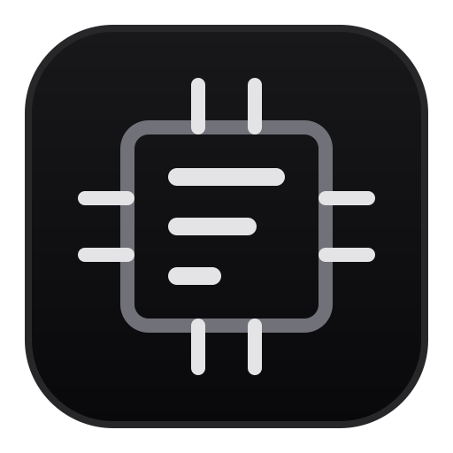

<p align="center">
  
</p>

# SysPulse

A comprehensive C++ system stress testing tool that performs simultaneous CPU and memory stress testing with real-time monitoring and colorized console output.

## Features

- **Multi-threaded CPU stress testing** with hash-intensive operations
- **Memory stress testing** with configurable allocation targets
- **Real-time progress monitoring** with visual progress bars
- **Cross-platform support** (Windows and Unix-like systems)
- **Colorized console output** for better visibility
- **Automatic CPU core detection** and utilization
- **Thread-safe operations** with proper synchronization

## Demo

The tool displays real-time progress with:

- Time progress bar showing test duration
- Memory allocation progress with current usage
- Hash operations counter
- Colorized status messages

## Requirements

- **C++17 compatible compiler** (or C++20 for GUI)
- **just command runner**
- **curl, tar** (for fetching/building external dependencies if not present in system packages)
- **Threading support** (pthread on Unix, native threads on Windows)

### Platform-specific requirements

- **Windows**: Visual Studio 2017+ or MinGW-w64
- **Linux/macOS**: GCC 7+ or Clang 5+

## Installation & Usage

This project uses [just](https://github.com/casey/just) as a command runner.

### Using `just`

1. **Clone the repository**:

   ```bash
   git clone <repository-url>
   cd SysPulse
   ```

2. **Build and run the console app**:

   ```bash
   just build
   just run
   ```

3. **Build and run unit tests**:

   ```bash
   just test-build
   just test
   ```

4. **Build and run the GUI**:

   ```bash
   just gui-build
   just gui
   ```

*(Note: `just` automatically checks system packages for `slint-compiler` and `gtest` using `which`. If not found, it automatically fetches and builds them in the `libs/` directory).*

The program will:

1. Display a warning about system stress testing
2. Prompt for confirmation to continue
3. Detect available CPU cores
4. Run stress tests for 30 seconds (configurable)
5. Display real-time progress and metrics
6. Show final test results

### Configuration

Key parameters can be modified in `include/MemoryStressTest.hpp` for memory :

```cpp
    static constexpr int    MULTIPLIER = 2;                     // Memory multiplier for stress test (resulting in a 2 GB Max Allocation)
    static constexpr int    TEST_DURATION = 30;                 // seconds
    static constexpr size_t TARGET_MEMORY = 1024 * 1024 * 1024; // 1 GB

    // Memory bandwidth measurement constants
    static constexpr size_t BANDWIDTH_TEST_SIZE = 64 * 1024 * 1024; // 64MB test buffer
    static constexpr int    BANDWIDTH_ITERATIONS = 5;               // Number of iterations for averaging

```

## Project Structure

the icons are present because I use [eza](https://github.com/eza-community/eza) project set it up if you want them too

```bash
$ eza  --color=always --group-directories-first --links -a --tree --ignore-glob="*.log|*.tmp|.git|profiling|build"
.
├── flamegraphs
│   ├── calls_flamegraph.svg
│   ├── cpu_flamegraph.svg
│   └── memory_flamegraph.svg
├── include
│   ├── ConsoleColors.hpp
│   ├── ConsoleInitializer.hpp
│   ├── CPUStressTest.hpp
│   ├── LinkedList.hpp
│   ├── MemoryStressTest.hpp
│   └── TimeManager.hpp
├── Scripts
│   ├── kernel_security_bypass.sh
│   └── profile.sh
├── src
│   ├── ConsoleInitializer.cpp
│   ├── CPUStressTest.cpp
│   ├── main.cpp
│   ├── main_gui.cpp
│   ├── MemoryStressTest.cpp
│   └── TimeManager.cpp
├── tests
│   ├── test_cpustresstest.cpp
│   ├── test_linkedlist.cpp
│   ├── test_memorystresstest.cpp
│   └── test_timemanager.cpp
├── ui
│   ├── colors.slint
│   ├── main.slint
│   ├── metric_card.slint
│   ├── panel.slint
│   └── thread_bar.slint
├── .gitattributes
├── .gitignore
├── Doxyfile
├── justfile
├── LICENSE
├── README.md
└── shell.nix
```

## Technical Details

### CPU Stress Testing

- Uses compute-intensive hash-like operations
- Spawns one thread per CPU core
- Performs batched operations for efficiency
- Uses atomic counters for thread-safe operation tracking

### Memory Stress Testing

- Allocates memory in 1MB blocks
- Uses custom linked list for memory management
- Employs RAII principles with smart pointers
- Handles allocation failures gracefully

### Key Libraries Used

| Library | Purpose |
|---------|---------|
| `<iostream>` | Console I/O operations |
| `<mutex>` | Thread synchronization |
| `<vector>` | Dynamic memory containers |
| `<thread>` | Multi-threading support |
| `<chrono>` | Time measurement |
| `<atomic>` | Thread-safe variables |

### Cross-Platform Considerations

- **Windows**: Uses Windows API for console initialization and UTF-8 support
- **Unix-like systems**: Uses ANSI escape sequences for colors and formatting
- **Thread management**: Uses C++11 standard threading library

## Safety Features

- **Memory allocation limits** to prevent system crashes
- **Graceful error handling** for allocation failures
- **Thread-safe console output** with mutex protection
- **Controlled test duration** to prevent indefinite stress

## Performance Metrics

The tool tracks and displays:

- **Hash operations per second**: Measures CPU performance
- **Memory allocation rate**: Tracks memory subsystem performance
- **Real-time progress**: Visual feedback during testing
- **Resource utilization**: Shows CPU cores and memory usage

## Troubleshooting

### Common Issues

1. **Build fails on Windows**:
   - Ensure you have Visual Studio Build Tools installed
   - Use Developer Command Prompt for VS

2. **Colors not displaying**:
   - On Windows, ensure you're using Windows 10 version 1607 or later
   - Try running from Windows Terminal instead of cmd.exe

3. **Memory allocation errors**:
   - Reduce the `MULTIPLIER` value in the header file
   - Ensure sufficient system memory is available

### Performance Considerations

- **High memory usage**: This is intentional for stress testing
- **CPU temperature**: Monitor system temperature during extended use
- **System responsiveness**: Close other applications for accurate testing

## Contributing

1. Fork the repository
2. Create a feature branch
3. Make your changes
4. Ensure code follows the existing style
5. Add appropriate comments and documentation
6. Test on multiple platforms if possible
7. Submit a pull request

## License

This project is open source. Please refer to the license file for details.

## Acknowledgments

- Built with modern C++17 features
- Uses standard library threading and atomic operations
- Inspired by system benchmarking and stress testing tools

---

**Warning**: This tool is designed to stress your system. Use responsibly and monitor system temperature and stability during testing.
